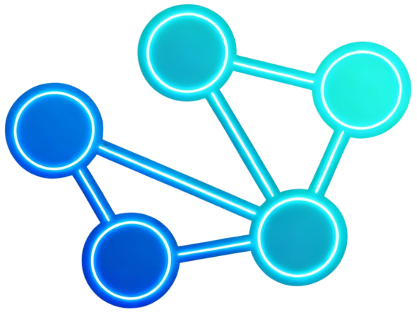
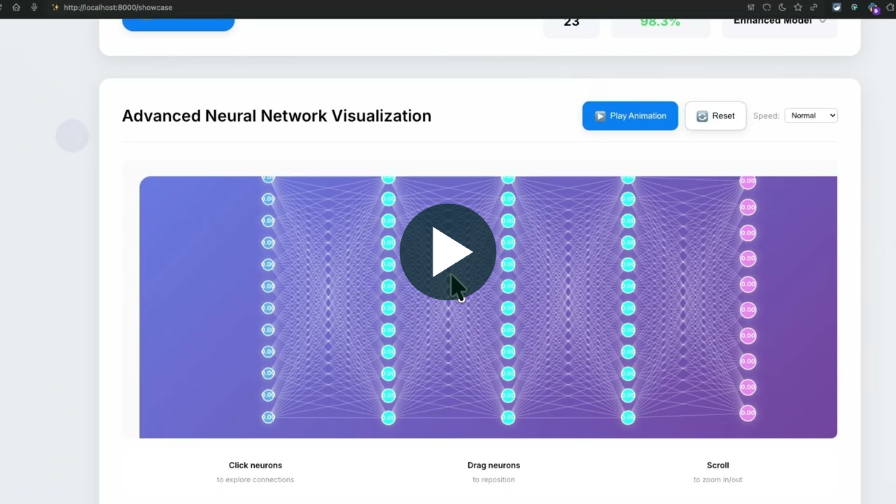
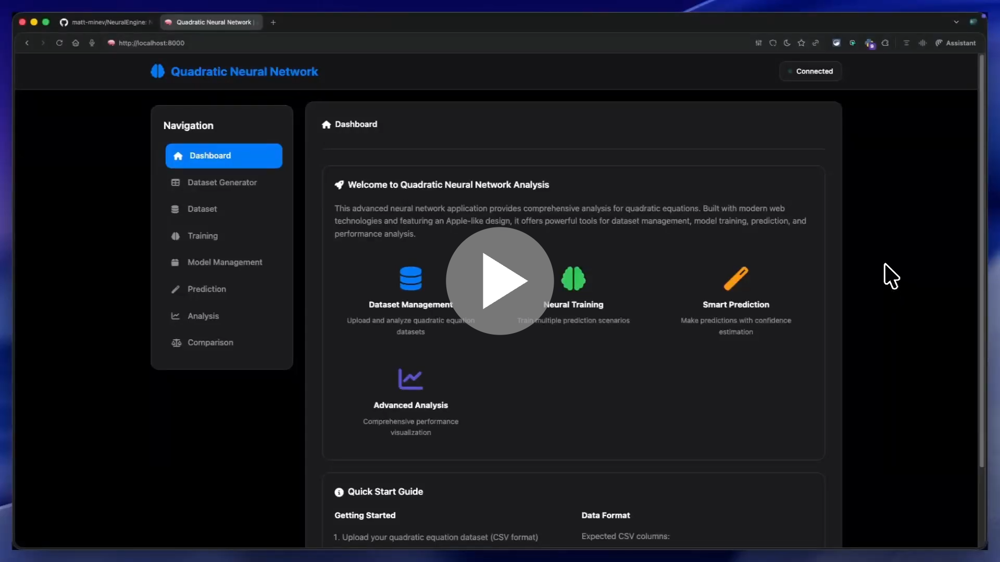

# 🧠 Neural Network Engine

**A modular, educational neural network library built from scratch in Python with automatic differentiation**

[](tests/)
[](https://python.org)
[](LICENSE)
[](README.md)

### 🌐 [Neural Engine - Official Website](https://neural.mattmaster.com)

> Explore demonstration videos, technical details, and additional information about Neural Engine.

[](https://neural.mattmaster.com)
<a href="https://neural.mattmaster.com">

</a>

---

## 🎯 Overview

The Neural Network Engine is a powerful yet beginner-friendly library designed to solve **function approximation problems** using neural networks. Built with educational clarity and mathematical rigor, it demonstrates how modern deep learning works under the hood.

## Showcase

### Hand Drawn Digit Recognizer

[](https://www.youtube.com/watch?v=kk1jcvemtKw)

### Neural Networks for Quadratic Equations

[](https://www.youtube.com/watch?v=m0iJYkEDGsc)

Find additional information on the [Neural Engine Official Website](https://neural.mattmaster.com).

### 🔬 Core Concept

Neural networks solve the fundamental machine learning problem:

```
Given: f(x) = Neural Network with parameters θ
Goal: Find θ* that minimizes Loss(f(x, θ), y_true)
Method: Gradient descent using automatic differentiation
```

---

## ✨ Key Features

### Core Engine

- **🔥 Automatic Differentiation**: Uses `autograd` for effortless gradient computation
- **🏗️ Modular Architecture**: Clean, extensible design for experimentation
- **📚 Educational Focus**: Extensively commented code explaining every concept
- **⚡ High Performance**: Optimized for speed with high sample throughput
- **🎨 Visualization Tools**: Includes tools for plotting network architecture and training progress
- **📊 Comprehensive Testing**: Robust test suite ensures reliability and correctness

### Advanced Training Features

- **🔄 Multi-Phase Training**: Fast learning → Fine-tuning → Optimization phases
- **📈 Learning Rate Scheduling**: Cosine annealing and step decay for optimal convergence
- **⏹️ Early Stopping**: Automatic training termination to prevent overfitting
- **🎯 Gradient Clipping**: Prevents exploding gradients during training
- **💾 Model Checkpointing**: Save and restore best models during training

### Application Suite

- **🔢 Digit Recognizer Web**: Interactive web app for handwritten digit recognition with smooth animations
- **📐 Quadratic Equation Solver**: Neural network solution for quadratic equations with web interface
- **🔤 Universal Character Recognizer**: Advanced character recognition (0-9, A-Z, a-z) with accessibility features
- **📊 Dataset Generators**: High-quality dataset generation for training

---

## 🚀 Quick Start

### Installation

```bash
# Clone the repository
git clone https://github.com/matt-minev/NeuralEngine.git
cd NeuralEngine

# Create virtual environment (recommended)
python -m venv .venv
source .venv/bin/activate  # On Windows: .venv\Scripts\activate

# Install dependencies
pip install -r requirements.txt

# Run core tests to verify installation
pytest tests/test_nn.py -v

# Optional GPU backend (install the CuPy wheel that matches your CUDA runtime)
# Example for CUDA 12.x:
pip install cupy-cuda12x
```

### Runtime Backend Selection

Use `NEURAL_ENGINE_DEVICE` and `NEURAL_ENGINE_BACKEND` to control execution:

```bash
# native execution backend (default)
export NEURAL_ENGINE_BACKEND=native

# python fallback backend (debug/rollback)
export NEURAL_ENGINE_BACKEND=python

# auto (default): use GPU if available, otherwise CPU
export NEURAL_ENGINE_DEVICE=auto

# force CPU
export NEURAL_ENGINE_DEVICE=cpu

# request GPU (falls back to CPU with a warning if unavailable)
export NEURAL_ENGINE_DEVICE=gpu
```

```python
from nn_core import NeuralNetwork

network = NeuralNetwork([2, 8, 1], ['relu', 'linear'])
print(network.backend_name, network.device, network.using_gpu, network.execution_backend)
```

### Your First Neural Network

```python
from nn_core import NeuralNetwork, mean_squared_error
from autodiff import TrainingEngine, Adam
from data_utils import create_sample_data

# Create sample data: y = 2x₁ + 3x₂ + 1
X, y = create_sample_data(1000)

# Build neural network: 2 inputs -> 8 hidden -> 4 hidden -> 1 output
network = NeuralNetwork([2, 8, 4, 1], ['relu', 'relu', 'linear'])

# Set up training with Adam optimizer
trainer = TrainingEngine(network, Adam(learning_rate=0.001), mean_squared_error)

# Train the network
history = trainer.train(X, y, epochs=100, verbose=True)

# Make predictions
predictions = network.predict([[5, 2], [6, 4]])
print(f"Predictions: {predictions}")
```

---

## 📖 Architecture Overview

The project is organized into a core library and a suite of standalone applications.

```
NeuralEngine/
│
├── main.py                  # Entry point with educational demonstrations
├── nn_core.py               # Core neural network implementation
├── autodiff.py              # Manual backprop training engine and optimizers
├── data_utils.py            # Data loading, preprocessing, and utilities
├── utils.py                 # Activation functions and helper tools
├── cleanup.py               # Utility scripts for cleanup
│
├── apps/                    # Standalone applications
│   ├── quadratic_equation/  # Desktop GUI for solving quadratic equations
│   ├── quadratic_web/       # Web app for quadratic equation solver
│   │   ├── core/            # Core prediction and data processing
│   │   ├── config/           # Configuration and scenarios
│   │   ├── static/           # Frontend assets (CSS, JS)
│   │   └── templates/        # HTML templates
│   ├── digit_recognizer/    # Base application for digit recognition
│   ├── digit_recognizer_extended/ # Extended version with enhanced models
│   ├── digit_recognizer_web/      # Web interface for digit recognition
│   │   ├── static/           # Frontend assets
│   │   └── templates/        # HTML templates
│   └── universal_recognizer_web/  # Advanced character recognizer web app
│       ├── core/            # Model management, prediction, preprocessing
│       ├── training/        # Training pipeline and data loading
│       ├── static/          # Frontend assets
│       └── templates/       # HTML templates
│
├── tests/
│   └── test_nn.py           # Comprehensive test suite for the core engine
│
├── documentation/           # Research papers and presentations
├── requirements.txt         # Project dependencies
├── README.md                # This file
├── LICENSE                  # Project license
└── CHANGELOG.md             # Changelog
```

---

## 🔧 Core Components

### Neural Network (`nn_core.py`)

- **Layer Class**: Individual computational units that form the network
- **NeuralNetwork Class**: A multi-layer function approximator that chains layers together

```python
# A network with 7 inputs, two hidden layers of 8 and 7 neurons, and 5 outputs
network = NeuralNetwork([7, 8, 7, 5], ['relu', 'relu', 'linear'])
predictions = network.forward(X)
```

### Automatic Differentiation (`autodiff.py`)

- **Optimizers**: Advanced gradient-based learning algorithms like `SGD` and `Adam`
- **Training Engine**: Complete pipeline for training models, handling epochs, batching, and validation

```python
trainer = TrainingEngine(network, Adam(learning_rate=0.001), mean_squared_error)
history = trainer.train(X, y, epochs=100, validation_data=(X_val, y_val))
```

### Data & General Utilities (`data_utils.py`, `utils.py`)

- **Data Processing**: Tools for loading, normalizing, scaling, and splitting datasets
- **Activation Functions**: Collection of standard activations (`relu`, `sigmoid`, `tanh`, etc.)
- **Visualization**: Helpers to plot network architecture and training metrics

```python
NetworkVisualizer.plot_network_architecture([2, 8, 4, 1])
NetworkVisualizer.plot_training_metrics(history)
```

---

## 🎮 Applications

### 🔢 Digit Recognizer Web

**Description**: Interactive web application for recognizing handwritten digits (0-9) with a beautiful, modern interface.

**Features**:

- Real-time digit recognition as you draw
- Multiple model selection (Enhanced, Bulletproof, Optimized, Basic)
- Smooth animations and micro-interactions
- Prediction history tracking
- Keyboard shortcuts (C to clear, 0-9 for hints)
- Tutorial overlay for first-time users
- Particle effects on successful predictions
- Confidence visualization with animated bars

**To Run**:

```bash
cd apps/digit_recognizer_web
python app.py
# Open http://localhost:5000 in your browser
```

**Usage**:

1. Draw a digit (0-9) on the canvas
2. View real-time predictions with confidence scores
3. Switch between different trained models
4. Use keyboard shortcuts for quick actions

---

### 📐 Quadratic Equation Solver

**Description**: Neural network solution for finding roots of quadratic equations. Available as both desktop GUI and web application.

**Features**:

- Multiple prediction scenarios (coefficients to roots, roots to coefficients, etc.)
- High-quality dataset generator for school-grade equations
- Multi-phase training with learning rate scheduling
- Early stopping and model checkpointing
- Prediction refinement with root verification
- Comprehensive performance analysis
- Model comparison and ranking

**To Run (Web)**:

```bash
cd apps/quadratic_web
python app.py
# Open http://localhost:5000 in your browser
```

**To Run (Desktop)**:

```bash
cd apps/quadratic_equation
python main.py
```

**Dataset Generator**:
The web app includes an advanced dataset generator that creates:

- Equations with whole number coefficients
- Perfect square discriminants
- Integer roots
- Easy-to-solve problems suitable for 10th graders

**Training Features**:

- Multi-phase training (Fast Learning → Fine-tuning → Optimization)
- Learning rate scheduling (cosine annealing)
- Early stopping with configurable patience
- Automatic best model selection

---

### 🔤 Universal Character Recognizer Web

**Description**: Advanced web application for recognizing all alphanumeric characters (0-9, A-Z, a-z) with accessibility features.

**Features**:

- Universal character recognition (62 classes)
- Mirror detection for dyslexic users
- Writing quality analysis
- Test mode with EMNIST dataset samples
- Debug panel for preprocessing visualization
- Dark/light theme support
- Modern dashboard design

**To Run**:

```bash
cd apps/universal_recognizer_web
python app.py
# Open http://localhost:8000 in your browser
```

**Training**:

```bash
cd apps/universal_recognizer_web
python training/train.py --config high_accuracy
```

**Usage**:

1. Draw any alphanumeric character on the canvas
2. View predictions organized by type (Digits, Uppercase, Lowercase)
3. Check accessibility panel for mirror detection and suggestions
4. Use test mode to evaluate model on EMNIST dataset samples

---

## 📊 API Documentation

### Core Engine API

#### NeuralNetwork

```python
from nn_core import NeuralNetwork

# Create network
network = NeuralNetwork(
    layer_sizes=[784, 512, 256, 128, 62],
    activations=['relu', 'relu', 'relu', 'softmax']
)

# Forward pass
predictions = network.forward(X)

# Get parameters
params = network.get_all_parameters()

# Set parameters
network.set_all_parameters(params)
```

#### TrainingEngine

```python
from autodiff import TrainingEngine, Adam
from nn_core import mean_squared_error

# Create trainer
trainer = TrainingEngine(
    network=network,
    optimizer=Adam(learning_rate=0.001),
    loss_function=mean_squared_error
)

# Train model
history = trainer.train(
    X_train, y_train,
    epochs=1000,
    validation_data=(X_val, y_val),
    verbose=True,
    plot_progress=False
)
```

### Web Application APIs

#### Digit Recognizer Web

**Endpoint**: `POST /predict`

- **Request**: `{ "image": "data:image/png;base64,..." }`
- **Response**: `{ "predicted_digit": 5, "confidence": 95.2, "predictions": [...], "prediction_time": 12.3 }`

**Endpoint**: `POST /switch_model`

- **Request**: `{ "model_name": "enhanced_digit_model.pkl" }`
- **Response**: `{ "status": "success", "model_info": {...} }`

#### Quadratic Web

**Endpoint**: `POST /api/training/start`

- **Request**: `{ "scenarios": [...], "epochs": 1000, "learning_rate": 0.001 }`
- **Response**: `{ "status": "started" }`

**Endpoint**: `GET /api/training/status`

- **Response**: `{ "is_training": true, "progress": 45, "current_scenario": "...", "logs": [...] }`

**Endpoint**: `POST /api/predict`

- **Request**: `{ "scenario": "...", "input": [a, b, c] }`
- **Response**: `{ "prediction": [...], "confidence": 0.95 }`

#### Universal Recognizer Web

**Endpoint**: `POST /predict`

- **Request**: `{ "image": "data:image/png;base64,...", "debug": true }`
- **Response**: `{ "prediction": {...}, "debug": {...} }`

**Endpoint**: `POST /predict/accessibility`

- **Request**: `{ "image": "data:image/png;base64,..." }`
- **Response**: `{ "prediction": {...}, "mirror_detection": {...}, "quality_metrics": {...} }`

---

## 🧪 Testing

The project includes a comprehensive test suite covering the core engine and individual applications.

**Run Core Engine Tests**:

```bash
# Run all core tests with verbose output
pytest tests/test_nn.py -v
```

**Run Application-Specific Tests**:

```bash
# Digit recognizer
pytest apps/digit_recognizer/comprehensive_test.py

# Universal recognizer
pytest apps/universal_recognizer/comprehensive_universal_test.py

# Quadratic web app
pytest apps/quadratic_web/tests/test_web_app.py
```

**Test Coverage Includes**:

- ✅ Core engine: Layers, network, optimizers, loss functions
- ✅ Utilities: Data processing and helper functions
- ✅ Integration Workflows: End-to-end training and prediction
- ✅ Application Logic: Tests for each standalone application

---

## 🚀 Performance & Benchmarks

### Training Performance

**Digit Recognizer**:

- Training time: ~2-4 hours on M4 Mac mini (24GB RAM)
- Accuracy: 95%+ on MNIST test set
- Architecture: [784, 512, 256, 128, 10]

**Universal Character Recognizer**:

- Training time: ~4-5 hours on M4 Mac mini (24GB RAM)
- Accuracy: 86.61% overall (94.9% digits, 83.6% uppercase, 72.4% lowercase)
- Architecture: [784, 512, 256, 128, 62]

**Quadratic Equation Solver**:

- Training time: Varies by dataset size (typically 5-30 minutes)
- Target accuracy: >90% R² score for root prediction
- Multi-phase training reduces training time by 20-30%

### Optimization Tips

1. **Use Multi-Phase Training**: Reduces training time while improving accuracy
2. **Enable Early Stopping**: Prevents overfitting and saves computation
3. **Batch Size**: Larger batches (128-256) for faster training on modern hardware
4. **Learning Rate Scheduling**: Cosine annealing provides better convergence
5. **Model Caching**: Web apps cache predictions for identical inputs

---

## 🔧 Troubleshooting

### Common Issues

**Import Errors**:

```bash
# Ensure you're in the virtual environment
source .venv/bin/activate  # On Windows: .venv\Scripts\activate

# Install dependencies
pip install -r requirements.txt
```

**Model Not Found**:

```bash
# Check model file exists
ls apps/universal_recognizer_web/models/universal_character_model.pkl

# Train model if missing
cd apps/universal_recognizer_web
python training/train.py --config high_accuracy
```

**Port Already in Use**:

```python
# Change port in app.py
app.run(debug=True, host='0.0.0.0', port=8001)
```

**Training Too Slow**:

- Reduce dataset size for testing
- Use smaller network architecture
- Enable early stopping
- Reduce number of epochs
- Use GPU execution (`NEURAL_ENGINE_DEVICE=auto` or `gpu`)

**Low Accuracy**:

- Check data preprocessing matches training
- Verify model architecture
- Increase training epochs
- Try different learning rates
- Use multi-phase training

---

## 🛣️ Roadmap

### Planned Features

- [ ] Distributed training
- [ ] Model quantization for deployment
- [ ] Additional activation functions
- [ ] More advanced optimizers (AdamW, RMSprop)
- [ ] Hyperparameter tuning automation
- [ ] Model versioning system
- [ ] REST API server mode
- [ ] Docker containerization
- [ ] CI/CD pipeline

### Recent Improvements

- ✅ NumPy/CuPy backend with optional GPU acceleration and CPU fallback
- ✅ Multi-phase training with learning rate scheduling
- ✅ Early stopping and model checkpointing
- ✅ Enhanced dataset generator for quadratic equations
- ✅ Tab persistence in quadratic web app
- ✅ Smooth animations in digit recognizer web
- ✅ Prediction refinement with root verification
- ✅ Comprehensive README documentation

---

## 🤝 Contributing

We welcome contributions! Here's how you can help:

### Development Setup

```bash
# Fork the repository and clone it
git clone https://github.com/matt-minev/NeuralEngine.git
cd NeuralEngine

# Create virtual environment
python -m venv .venv
source .venv/bin/activate  # On Windows: .venv\Scripts\activate

# Install development dependencies
pip install -r requirements.txt
pip install pytest pytest-cov

# Run tests to ensure everything works
pytest
```

### Contribution Guidelines

1. Fork the repository
2. Create a feature branch (`git checkout -b feature/amazing-feature`)
3. Make your changes
4. Add tests for new functionality
5. Ensure all tests pass (`pytest`)
6. Commit your changes (`git commit -m 'Add amazing feature'`)
7. Push to the branch (`git push origin feature/amazing-feature`)
8. Open a Pull Request

### Code Style

- Follow PEP 8 style guide
- Add docstrings to all functions and classes
- Include type hints where appropriate
- Write tests for new features
- Update documentation as needed

---

## 📋 Requirements

### Core Dependencies

- **Python**: 3.8+
- **NumPy**: ≥1.20.0
- **Autograd**: ≥1.3.0
- **Pandas**: ≥1.3.0
- **Matplotlib**: ≥3.5.0
- **Scikit-learn**: ≥1.0.0
- **Pytest**: ≥6.2.0

### Web Application Dependencies

- **Flask**: ≥2.0.0
- **Pillow**: ≥8.0.0
- **Scipy**: ≥1.7.0 (for image processing)

### Optional Dependencies

- **Jupyter**: For interactive notebooks
- **TensorBoard**: For advanced visualization (future)

---

## 📄 License

This project is licensed under the MIT License - see the [LICENSE](LICENSE) file for details.

---

## 🙏 Acknowledgments

- **Autograd Team**: For providing excellent automatic differentiation
- **NumPy Community**: For foundational numerical computing tools
- **EMNIST Dataset**: For character recognition training data
- **Open Source Community**: For the tools and libraries that made this possible

---

## 📞 Contact & Support

- **Developer**: Matt
- **Project**: Neural Network Engine
- **Status**: Active development and maintenance
- **Website**: [https://neural.mattmaster.com](https://neural.mattmaster.com)

---

## 📚 Additional Resources

- [Official Website](https://neural.mattmaster.com) - Demonstration videos and technical details
- [Research Paper](documentation/main/main.pdf) - Theoretical foundations
- [Presentation](documentation/presentation/Presentation.pdf) - Project overview

---

**Ready to explore the fascinating world of neural networks? Start with the Quick Start guide above and dive into the mathematical beauty of machine learning! 🧠✨**
